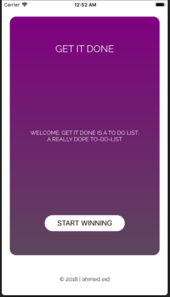
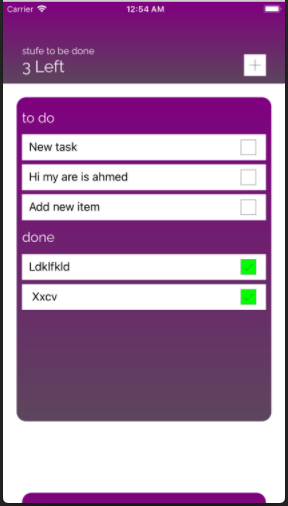
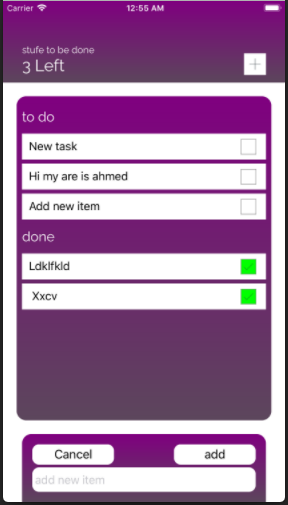
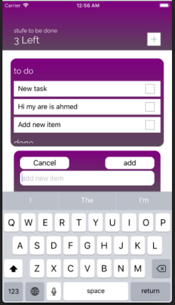
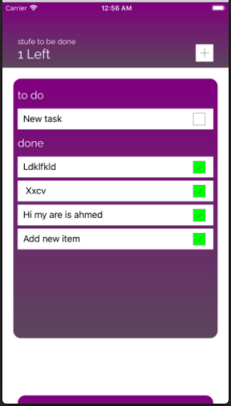

# ToDo-App
<ul>
    <li>ToDo App For IOS with Swift4</li>
   </ul>

  
  
  
  
  

## What is the contents of this Project? 
<ol>
<li> ToDo-App Folder</li>
      <ul>
      <li>ViewColntrollers Folder</li>
      <li>Custom Folder</li>
      <li>Extention Folder</li>
      <li>Fonts Folder</li>
      <li>Protocols Folder</li>
      </ul>

<li> ViewController Folder you will found 3 file.swift </li>
    <ul>
      <li>ViewController.swift it is the home page</li>
      <li>ListViewController.swift it the second page that contain custom table view, header, and custom view to add new item</li>
      <li>CoreDataManager.swift that is Contain all the method that is Manage the Connection with database and the App</li>
    </ul>
<li> Custom Folder</li>
    <ul>
      <li>GDGradaint.swift (Modle) Useing For Control in the Backgournd color with Gradaint</li>
      <li>GDLable.swift (Model) Useing for Creat Any custom Lable in the app</li>
      <li>GDButton.swift (Model) Using for Create Any custom Button in the app</li>
      <li>GDHeader.swift (Model) Custom UIView For Build the app's header</li>
      <li>GDNewItemPopup.swift (Model) Custom UIViwe Used For Add new item to todo list</li>
      <li>GDTextField.swift (Model) Custom UITextField for Any textfield in the app</li>
      <li>GDTableView.swift (Model) Custom TableView, act the toDo List</li>
      <li>GDCustomTableView.swift (Model) Custom TableView with Custom UITableViewCell</li>
      <li>GDButtonBox.swift (Model) Custom Button From GDButton, act check box in the todo list</li>
    </ul>
  
<li> extention Folder</li>
    <ul>
      <li>extention.swift  Make extention in UIColor and UIView</li>
      <li>ButtonOptions.swift Determine if the button is square or round</li>
    </ul>
<li> Fonts Folder</li>
    <ul>
      <li>this Folder Contain Custom Font that used in the app</li>
    </ul>
<li> Protocols Folder</li>
    <ul>
      <li>MyProtocol.swift   Contain each protocol used in the app</li>
    </ul>

</ol>
